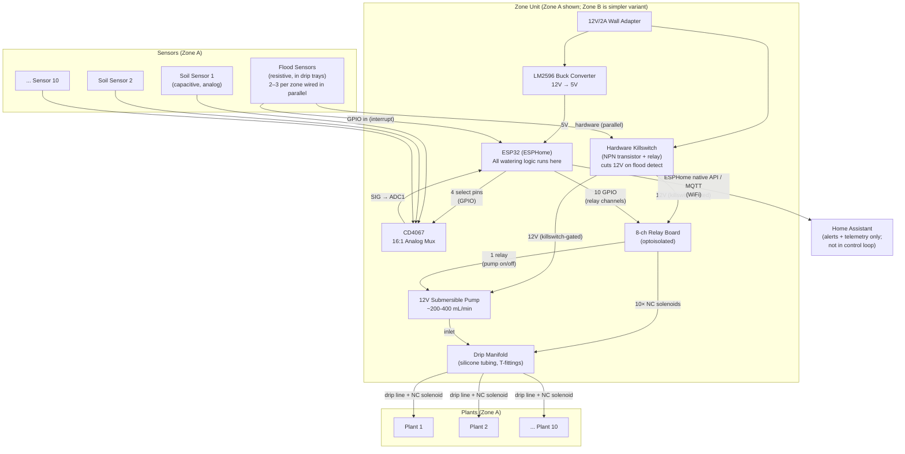

# System Architecture

Last updated: 2026-05-21

## Overview

Two independent, decentralized zone units. Each unit is self-contained: one ESP32 running ESPHome, one reservoir, one pump, N soil moisture sensors, N solenoid valves, and a hardware flood killswitch. Zones share no hardware and have no dependency on each other.

- **Zone A**: ~10 plants (mixed succulents + tropicals)
- **Zone B**: 2–3 plants (includes rubber tree)

ESPHome makes all watering decisions locally. Home Assistant receives telemetry and alerts over WiFi but has no role in watering logic — the system continues operating during internet or HA outages.

---

## Block Diagram

---

## Zone Unit Design

### Microcontroller: ESP32 + ESPHome
See ADR-001. ESPHome YAML config defines all sensors, valves, and automation logic. Each zone has its own device config.

### Soil Moisture Sensing
See ADR-003.

**Zone A (10 plants):** ESP32 ADC1 has 8 usable channels when WiFi is active. A CD4067 16:1 analog multiplexer routes all 10 sensors to a single ADC1 pin via 4 GPIO select pins. Sensors are read sequentially (no simultaneity needed for soil moisture). Each sensor has a configurable moisture threshold in the ESPHome config.

**Zone B (2–3 plants):** Sensors connect directly to ADC1 pins; no multiplexer required.

**Important:** ESP32 ADC is non-linear and noisy. All sensors require per-sensor calibration using ESPHome's `calibrate_linear` filter, mapping raw ADC values to 0–100% moisture. Calibration procedure: read in air (0%) and submerged in water (100%).

### Water Delivery
See ADR-002.

One 12V submersible pump sits in the reservoir. A drip manifold distributes water to N outlet lines, each controlled by a normally-closed 12V solenoid valve. The ESP32 opens one solenoid at a time (sequenced), runs the pump for a calibrated duration, then closes the solenoid before moving to the next plant that needs watering.

Watering trigger: soil moisture reading drops below plant-specific threshold → plant is added to the pending queue → queue is processed sequentially.

Pump is only powered when a solenoid is open. Both are cut by the hardware killswitch.

### Flood Safety System
See ADR-004.

Resistive water sensors in drip trays connect in parallel to a hardware relay circuit (NPN transistor + relay). The 12V power rail to the pump and solenoid relay board passes through this killswitch relay. Water detected → killswitch opens → pump and all solenoids lose power within milliseconds. This circuit has no dependency on ESP32 software.

The same sensors also connect to ESP32 GPIO interrupt pins. Flood detected → ESP32 publishes `flood_detected: true` to Home Assistant + disables all relay outputs in software as a belt-and-suspenders measure.

### Power Architecture
See ADR-005.

Single 12V/2A wall adapter per zone. Pump and solenoid valves run at 12V directly. LM2596 buck converter steps down to 5V for the ESP32 and relay board logic. Total worst-case draw: ~4W continuous, ~6W during active watering.

---

## Failure Modes and Mitigations

| Failure | Effect | Mitigation |
|---------|--------|-----------|
| Solenoid valve stuck open | Continuous water flow to one plant | Hardware flood killswitch trips when tray fills; NC valve closes on power loss |
| Pump relay stuck closed | Pump runs continuously | Solenoids all NC; no water flows unless a solenoid is also open |
| ESP32 software crash | Watering stops | All solenoids default NC (safe); hardware killswitch still active |
| WiFi / HA outage | Loss of remote visibility | All watering logic is local; no impact on operation |
| Power outage | Everything off | All NC solenoids close → no water flows (safe state) |
| Reservoir runs dry | Pump runs dry | Pump damage risk — mitigated by reservoir level sensor (if added); short watering pulses limit dry-run duration |
| Flood sensor failure (open circuit) | Killswitch relay de-energizes | Pump power cut (fail-safe — open circuit = safe) |
| Flood sensor failure (short circuit) | Killswitch always engaged | Pump never runs; no flooding risk; HA alert via ESP32 GPIO |

---

## Power Budget

Per zone (Zone A worst case):

| Component | Voltage | Current | Power |
|-----------|---------|---------|-------|
| ESP32 (WiFi active, peak) | 3.3V | 240mA | 0.8W |
| ESP32 (WiFi active, typical) | 3.3V | 80mA | 0.3W |
| 1× NC solenoid valve (open) | 12V | ~80mA | ~1.0W |
| Submersible pump (running) | 12V | ~200mA | ~2.5W |
| Relay board quiescent | 5V | 50mA | 0.25W |
| LM2596 buck converter loss (~15%) | — | — | ~0.2W |
| **Total (watering, peak)** | | | **~4.8W** |
| **Total (idle, no watering)** | | | **~0.8W** |

A 12V/2A (24W) adapter provides 5× headroom over peak draw. A 12V/1A adapter would also work but leaves less margin.

Zone B draw is similar or lower (fewer valves, smaller pump potentially).

---

## Communication

ESPHome native API connects to Home Assistant on the local network. All sensors, valve states, and flood alerts are exposed as HA entities. No cloud dependency. MQTT is an alternative if native API proves unreliable (ADR-001 covers this).

Home Assistant is used for:
- Monitoring moisture levels per plant
- Viewing watering event history
- Low reservoir alerts (if level sensor added)
- Flood detection alerts with push notification

Home Assistant does NOT control watering — all logic runs on-device.

---

## Open Design Questions

1. **Reservoir level sensing**: Not yet specified. A float switch or ultrasonic sensor (JSN-SR04T waterproof) would add low-water HA alerts and could halt watering when reservoir is empty (protecting the pump). Recommend adding — decision deferred to user.
2. **Zone B hardware**: Zone B (2–3 plants) can use the same hardware as Zone A with fewer components populated, or a simpler dedicated design (smaller relay board, no mux). BOM TBD.
3. **Solenoid valve sourcing**: Mini 12V NC barbed solenoid valves are not well-stocked at local retailers. May require overseas ordering (3–5 week lead time) or NPT-threaded valves with barbed adapters. See ADR-002 risk section.
